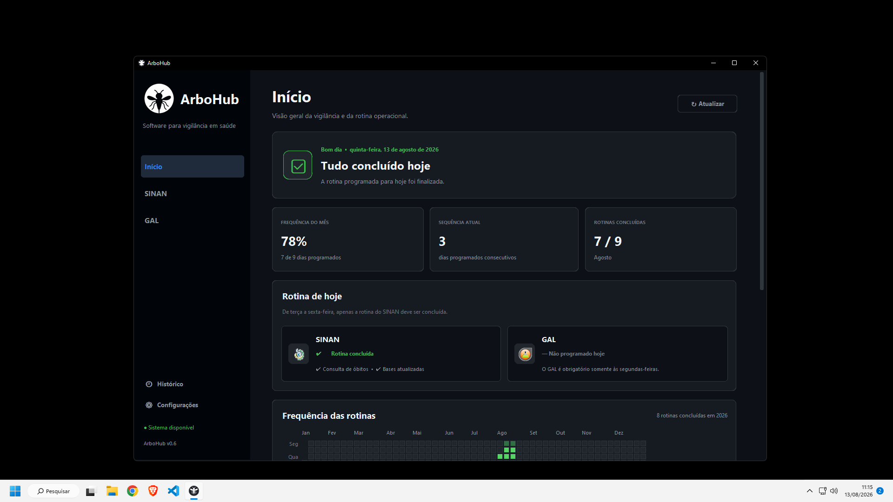

<p align="center">
  
</p>

# ArboHub - Vigilância e Automação em Saúde 🦟

<p>
  <a href="#status-do-projeto">
    
  </a>
  <a href="#tecnologias">
    
  </a>
  <a href="#requisitos">
    
  </a>
  <a href="#status-do-projeto">
    
  </a>
</p>

**ArboHub** é uma aplicação desktop em Python criada para apoiar, organizar e automatizar rotinas autorizadas de vigilância em saúde. Em uma única interface, o programa reúne o acompanhamento diário das atividades e fluxos relacionados ao **SINAN** e ao **GAL**.

Do painel de rotina à organização dos arquivos exportados, o ArboHub busca tornar processos repetitivos mais claros, rastreáveis e seguros, mantendo o operador no controle de cada etapa.

<p>
  <a href="https://github.com/jotapee3/ArboHub">
    
  </a>
  <a href="docs/ARQUITETURA.md">
    
  </a>
  <a href="docs/ROADMAP.md">
    
  </a>
</p>

> [!NOTE]
> O ArboHub é um projeto independente e em desenvolvimento. Ele não representa um produto oficial do SINAN ou do GAL, não concede acesso a esses sistemas e não substitui seus controles institucionais. Seu uso depende de credenciais, permissões e autorização adequadas.

<p align="center">
  
</p>

## Destaques do ArboHub ✨

- **Criado a partir de uma necessidade real:** transforma um fluxo operacional fragmentado em uma experiência única e organizada.
- **SINAN e GAL no mesmo lugar:** centraliza o acompanhamento das principais rotinas sem substituir os sistemas oficiais.
- **Automação com supervisão humana:** reduz tarefas repetitivas e preserva login, CAPTCHA e decisões críticas sob responsabilidade do operador.
- **Progresso fácil de acompanhar:** apresenta atividades previstas, pendências, etapas concluídas, frequência e histórico local.
- **Arquivos organizados e padronizados:** valida DBFs, CSVs e ZIPs antes de atualizar os destinos configurados.
- **Segurança desde a arquitetura:** mantém credenciais protegidas pelo Windows e evita armazenar dados clínicos no banco operacional.
- **Pronto para crescer:** estrutura modular preparada para receber novos fluxos e módulos de vigilância no futuro.

<a id="requisitos"></a>

## Requisitos 💻

### Para executar a versão portátil

- Windows 11 x64 ou Windows Server compatível e suportado;
- acesso institucional autorizado ao SINAN e ao GAL;
- permissão de leitura e gravação nos diretórios operacionais configurados;
- extração completa do pacote antes da execução;
- conexão de rede compatível com os portais utilizados.

A versão portátil inclui o ambiente necessário para a aplicação e não exige uma instalação separada do Python.

### Para desenvolvimento

- Python 3.14;
- Git;
- dependências registradas em `requirements.lock.txt`;
- Chromium gerenciado pelo Playwright.

## Instalação e execução 📥

<p>
  <a href="docs/DISTRIBUICAO_WINDOWS.md">
    
  </a>
</p>

> [!NOTE]
> A página de releases será utilizada quando o primeiro pacote público for aprovado. Enquanto isso, a versão portátil deve ser compartilhada apenas pelo canal autorizado do projeto.

### Executar o pacote portátil

1. Obtenha o arquivo `ArboHub-v0.6-windows-x64.zip` por um canal autorizado.
2. Confira o hash SHA-256 fornecido junto ao pacote.
3. Extraia todo o conteúdo para uma pasta estável.
4. Mantenha o `ArboHub.exe` junto das demais pastas e bibliotecas extraídas.
5. Abra `ArboHub.exe`.

> [!IMPORTANT]
> Não execute o programa diretamente de dentro do ZIP e não mova apenas o arquivo `ArboHub.exe`. O protótipo atual ainda não possui instalador ou assinatura digital; a distribuição ampliada permanece em validação.

### Executar pelo código-fonte

Clone o repositório e acesse sua pasta:

```powershell
git clone https://github.com/jotapee3/ArboHub.git
cd ArboHub
```

Prepare o ambiente:

```powershell
py -3.14 -m venv .venv
.\.venv\Scripts\Activate.ps1
python -m pip install --upgrade pip
python -m pip install -r requirements.lock.txt
python -m playwright install chromium
python scripts\verificar_ambiente.py
```

Abra o aplicativo:

```powershell
python main.py
```

Durante o desenvolvimento, também é possível iniciar o supervisor com reinicialização automática:

```powershell
python dev.py
```

## Por que o ArboHub existe? 🎯

Rotinas de vigilância podem exigir alternância entre sistemas, acompanhamento de solicitações, conferência de downloads, padronização de nomes e atualização de vários destinos. Quando todas essas etapas dependem apenas de controles manuais, aumentam as chances de repetição, esquecimento e dificuldade para verificar o que já foi concluído.

O ArboHub nasceu para reunir essas tarefas em um fluxo único e compreensível. A proposta não é retirar a decisão humana, mas oferecer uma interface que:

- indique as rotinas previstas para o dia;
- acompanhe o progresso de cada operação;
- reduza atividades manuais repetitivas;
- mantenha confirmações importantes sob responsabilidade do operador;
- organize os arquivos gerados nos destinos previamente autorizados;
- registre localmente o estado e o histórico operacional.

## Funcionalidades atuais 🛠️

### Centralize 🧭

- reúna as rotinas do SINAN e do GAL em uma única interface;
- visualize rapidamente o que está previsto, pendente ou concluído;
- acesse histórico e configurações sem depender de controles dispersos.

### Automatize com supervisão ⚡

- reduza etapas repetitivas de navegação, consulta e exportação;
- mantenha login, CAPTCHA e confirmações críticas sob responsabilidade humana;
- bloqueie a reexecução acidental de atividades já concluídas.

### Acompanhe o trabalho 📊

- painel diário com o estado das rotinas;
- frequência mensal e sequência de atividades realizadas;
- progresso detalhado durante cada operação;
- histórico operacional armazenado localmente.

### Organize os arquivos 🗂️

- confira e distribua as bases DBF recebidas do SINAN;
- valide e padronize o CSV semanal de sorotipos do GAL;
- gere o ZIP semanal com nomenclatura consistente;
- atualize histórico, bancos atuais e destinos de teste configurados.

### Trabalhe com SINAN e GAL 🔬

- apoio à consulta autorizada de óbitos por Dengue e Chikungunya;
- solicitação e acompanhamento de exportações de bases do SINAN;
- apoio à rotina semanal de exportação de sorotipos do GAL;
- atualização controlada dos bancos e diretórios definidos pelo setor.

### Personalize a experiência 🎨

- temas claro, escuro e compatível com o sistema;
- escala ajustável da interface;
- caminhos operacionais configuráveis;
- identificação local do responsável pela conta do Windows;
- canal institucional de suporte configurável.

## Segurança e privacidade 🔒

O ArboHub foi estruturado para trabalhar com metadados de rotina e arquivos nos destinos autorizados, sem transformar seu banco local em uma base clínica.

- o SQLite operacional não deve armazenar registros individuais de pacientes;
- a credencial do SINAN é mantida no Gerenciador de Credenciais do Windows;
- configurações e banco ativo ficam em `%LOCALAPPDATA%\ArboHub`;
- conexões SQLite são encerradas explicitamente;
- consultas somente leitura utilizam o modo protegido do SQLite;
- endereços HTTPS e hostnames esperados são validados antes da autenticação;
- arquivos exportados não são incorporados ao repositório;
- não existe envio automático de arquivos, banco ou progresso para outro computador;
- solicitações de suporte exigem revisão e confirmação do operador.

O `.gitignore` bloqueia bancos, CSVs, DBFs, ZIPs operacionais, credenciais, logs, rastros de navegador, capturas e chaves privadas. Mesmo assim, toda publicação deve ser revisada antes do commit.

<a id="tecnologias"></a>

## Tecnologias e estrutura 🧩

| Tecnologia | Uso no ArboHub |
| --- | --- |
| Python | regras de negócio, serviços e automações |
| CustomTkinter | interface desktop com temas e escala |
| Playwright | automação supervisionada dos portais |
| SQLite | estado e histórico operacional local |
| Pillow | processamento dos recursos visuais |
| PyInstaller | geração do protótipo portátil para Windows |
| unittest | testes automatizados |

```text
ArboHub/
├── app/
│   ├── automation/     # Navegação e exportações do SINAN e GAL
│   ├── core/           # Banco, caminhos, ambiente e segurança
│   ├── gui/            # Janelas, páginas, componentes e temas
│   └── services/       # Regras de negócio e integrações locais
├── assets/             # Recursos visuais dos sistemas
├── docs/               # Arquitetura, segurança e distribuição
├── scripts/            # Build, verificação e diagnósticos
├── tests/              # Testes automatizados
├── main.py             # Entrada principal
└── requirements*.txt   # Dependências do projeto
```

<a id="status-do-projeto"></a>

## Situação do desenvolvimento e próximos passos 🚧

O ArboHub está na versão **v0.6**, em estabilização arquitetural e validação interna.

### Concluído na versão atual

- fluxos operacionais do SINAN e do GAL;
- armazenamento local fora da pasta do programa;
- ambiente de desenvolvimento reproduzível;
- testes de serviços, banco, segurança e empacotamento;
- protótipo portátil `onedir` para Windows;
- auditoria das dependências fixadas sem vulnerabilidades conhecidas na data da revisão.

### Próximas etapas

- validar o pacote em um segundo computador controlado;
- definir assinatura digital ou implantação institucional;
- concluir a avaliação da cadeia de certificado utilizada no acesso ao GAL;
- ampliar a cobertura dos testes automatizados;
- avaliar o compartilhamento seguro apenas do estado das rotinas;
- preparar uma futura versão instalável;
- expandir o ArboHub com novos módulos de vigilância.

Consulte o [roadmap](docs/ROADMAP.md) e a [documentação de segurança](docs/SEGURANCA_E_DADOS.md) para mais detalhes.

## Licença e uso

O projeto ainda não possui uma licença pública de uso e redistribuição. A presença do código no GitHub não representa autorização automática para acesso aos sistemas, uso institucional ou tratamento de dados de saúde.

## Autor e contato 👤

Desenvolvido por **João Paulo da Silveira Velho**, estudante do Bacharelado em **Informática Biomédica na Universidade Federal de Ciências da Saúde de Porto Alegre (UFCSPA)**, como projeto aplicado de automação, desenvolvimento de software e tecnologia em saúde.

<p>
  <a href="https://github.com/jotapee3">
    
  </a>
  <a href="https://github.com/jotapee3/ArboHub/issues">
    
  </a>
  <a href="https://www.linkedin.com/in/joao-paulo-velho/">
    
  </a>
</p>
