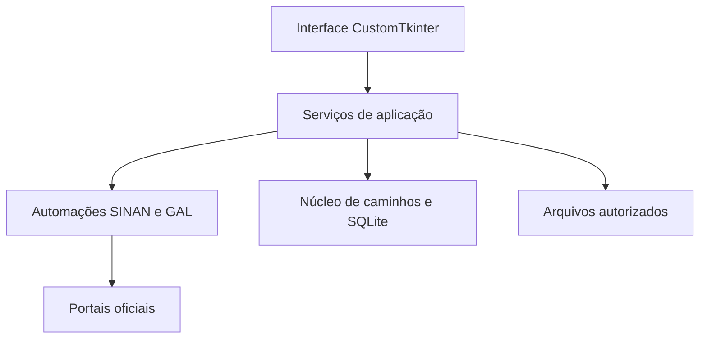

# Arquitetura do ArboHub

## Visão geral

O ArboHub é uma aplicação desktop em Python para Windows. A interface usa CustomTkinter, as automações web usam Playwright e o estado operacional é mantido em SQLite no perfil local do usuário.

A interface não deve acessar diretamente o SQLite nem controlar detalhes do navegador. Essas responsabilidades ficam concentradas nas camadas abaixo.

## Estrutura

| Caminho | Responsabilidade |
| --- | --- |
| `main.py` | prepara tema e escala e inicia a janela principal |
| `dev.py` | supervisor de desenvolvimento com reinicialização automática |
| `app/gui/` | janelas, páginas, componentes, temas e recursos visuais |
| `app/services/` | regras operacionais, coordenação dos fluxos, configurações, histórico e arquivos |
| `app/services/qualifica/` | regras isoladas dos indicadores e relatórios do Qualifica Vigilância |
| `app/automation/sinan/` | navegação e interação com o portal SINAN |
| `app/automation/gal/` | navegação, exportação e obtenção do relatório do GAL |
| `app/core/caminhos.py` | caminhos locais compartilhados do aplicativo |
| `app/core/database.py` | caminho, migração, abertura e fechamento do SQLite |
| `app/core/seguranca_urls.py` | validação de HTTPS e hostname dos portais |
| `app/core/versao.py` | identificação única da versão exibida |
| `assets/sistemas/` | marcas visuais do SINAN e GAL usadas pela interface |
| `tests/` | testes automatizados sem acesso aos portais reais |
| `scripts/` | diagnósticos manuais de desenvolvimento; não fazem parte do uso comum |

## Camadas

### Interface

`app/gui` apresenta os estados e recebe as decisões do operador. As páginas ficam em cache durante a sessão para preservar navegação e reduzir reconstruções desnecessárias.

Páginas atuais:

- Início;
- SINAN;
- GAL;
- Histórico;
- Configurações.

### Serviços

`app/services` contém as regras que podem ser testadas sem depender da apresentação visual. Entre as responsabilidades atuais estão:

- checkpoints de consulta e atualização;
- estado do painel diário;
- coordenação das rotinas SINAN e GAL;
- validação, organização e substituição segura de arquivos;
- configurações locais;
- histórico operacional;
- cálculos agregados e exportações do Qualifica, sem persistir linhas de pacientes;
- credenciais e identidade do Windows;
- manutenção, backup e reset controlado.

### Automação

`app/automation` encapsula seletores, navegação e ações nos portais. O Chromium é aberto de forma visível (`headless=False`) para manter supervisão humana sobre o fluxo.

### Núcleo

`app/core` concentra infraestrutura reutilizada por vários serviços:

- resolução da raiz do projeto;
- localização de `%LOCALAPPDATA%\ArboHub`;
- migração não destrutiva do banco legado;
- conexão SQLite com fechamento garantido;
- ativação opcional de chaves estrangeiras e modo SQLite realmente
  somente leitura;
- seleção do Chromium interno quando a aplicação está empacotada;
- validação dos endereços HTTPS oficiais antes da autenticação.

## Inicialização e migração

Na abertura, os serviços resolvem o banco operacional padrão. Se o banco local ainda não existir e houver `data\arbohub.db`, o aplicativo:

1. abre o banco antigo sem alterá-lo;
2. cria uma cópia temporária no perfil local;
3. usa o backup nativo do SQLite;
4. executa `PRAGMA quick_check`;
5. publica a cópia somente após a validação;
6. mantém o arquivo antigo intacto.

Um banco local já existente nunca é sobrescrito pela migração.

## Estado operacional

O SQLite registra metadados necessários para continuidade local, incluindo:

- data de referência;
- estado e horários das rotinas;
- agravo consultado;
- responsável identificado pelo Windows;
- resultado e observação operacional;
- identificadores de lotes e números de solicitações de exportação.

O banco não deve receber linhas de pacientes nem o conteúdo de DBF, CSV ou ZIP.

## Inclusão de novos módulos

Uma nova aba deve respeitar a mesma divisão:

1. automação isolada em `app/automation/<modulo>` quando houver portal externo;
2. regras e persistência em serviços testáveis;
3. interface em `app/gui/pages` sem SQL direto;
4. caminhos compartilhados definidos em `app/core` ou nas configurações;
5. testes de regressão antes da integração ao painel e histórico;
6. revisão dos dados armazenados e das permissões exigidas.

As subabas do Qualifica são desenvolvidas como módulos independentes sobre
um núcleo comum. Cada módulo precisa ser validado isoladamente antes de ser
ligado à página visual do Qualifica.

A página visual apenas coleta os caminhos autorizados e apresenta resultados
agregados. O relatório de 72 horas executa o serviço em uma thread de trabalho,
carrega o dicionário institucional empacotado e publica o XLSX somente depois
da validação atômica realizada pelo serviço.

O acompanhamento das exportações DBF verifica a autenticação antes de cada
nova atualização da tabela. Se o cabeçalho indicar `Sessão Expirada!`, mesmo
com URL protegida e tabela ainda visível, a camada de serviço encerra a sessão,
refaz o login e retoma os números de solicitação já registrados sem criar um
novo lote.

## Limites atuais

- não existe servidor ou sincronização entre computadores;
- o SQLite é local e não possui criptografia própria;
- o desenvolvimento depende de Python e Playwright, mas o protótipo
  `onedir` inclui o interpretador, as bibliotecas e o Chromium;
- as versões estão fixadas para reprodução, porém o arquivo fechado
  ainda não possui hashes de todos os pacotes;
- o executável ainda não possui assinatura digital;
- o GAL ainda ignora erros do certificado HTTPS e exige decisão da TI;
- os scripts auxiliares não são uma API pública e podem depender do estado dos portais.
